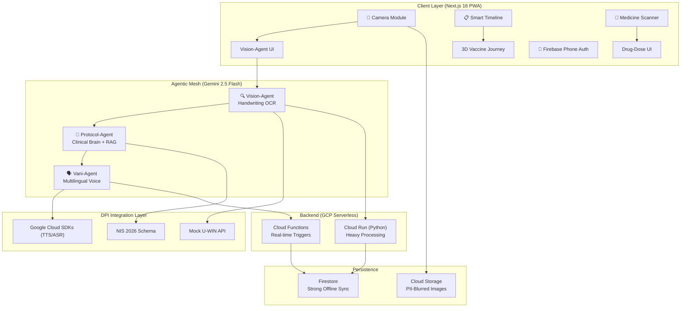

# Sanjeevani-Kavach — System Design & Implementation Plan

> **DPI-Enhanced Agentic Health Companion for India's Universal Immunization Programme**

---

## 1. Problem Statement & Background

India's Universal Immunization Programme (UIP) serves **27 million newborns and 30 million pregnant women** annually. Despite digital efforts like U-WIN, the majority of rural vaccination records still exist on **handwritten "Yellow Cards"** — paper immunization records maintained by ASHA workers. These cards suffer from:

- Illegible handwriting, smudges, and inconsistent date formats
- No digital sync — missed doses go undetected until outbreaks
- Language barriers — ~22 official languages, 12+ major dialects
- Connectivity gaps — many PHCs operate in "Data Dark" zones

**Sanjeevani-Kavach** bridges this gap by using an agentic AI system to digitize, validate, and proactively manage immunization journeys.

---

## 2. High-Level Architecture



---

## 3. Agentic Mesh Design

### 3.1 Vision-Agent (Primary Showstopper)

| Attribute | Detail |
|-----------|--------|
| **Model** | Gemini 2.5 Flash (multimodal, `media_resolution: HIGH`) |
| **Input** | Camera capture of Yellow Card (JPEG/PNG, max 10MB) |
| **Output** | Structured JSON conforming to NIS 2026 schema |
| **Strategy** | Chain-of-Thought (CoT) prompting with 3-pass verification |

**CoT Pipeline (3-Pass for 99.9% Date Accuracy):**

```
Pass 1 — Raw Extraction:
  "Analyze this Indian immunization card image. Extract ALL 
   vaccine entries. For each, identify: vaccine_name, date_given 
   (in DD/MM/YYYY), batch_number. Think step by step."

Pass 2 — Cross-Validation:
  "Given the extracted data, verify: Are dates chronologically 
   consistent? Does the vaccine sequence match Indian NIS 2026? 
   Flag any anomalies."

Pass 3 — Schema Mapping:
  "Map each entry to the NIS 2026 schema. Normalize vaccine 
   names to standard codes. Convert all dates to ISO 8601. 
   Return final structured JSON."
```

**PII Anonymization:** Before cloud logging, the Vision-Agent runs a secondary pass to detect and blur (Gaussian, σ=15) any visible names, Aadhaar numbers, or addresses in the image.

### 3.2 Protocol-Agent (Clinical Brain)

| Attribute | Detail |
|-----------|--------|
| **Foundation** | RAG pipeline grounded in MoHFW 2026 guidelines |
| **Knowledge Base** | NIS 2026 JSON schema + catch-up schedule rules + contraindication database |
| **Core Functions** | Catch-up schedule calculation, contraindication checks, urgency scoring |

**Urgency Scoring Algorithm:**
```
GREEN  (On-track)  → Next dose ≥ 14 days away
YELLOW (Due)       → Next dose within 0–14 days
RED    (Critical)  → Dose overdue by any amount
```

### 3.3 Vani-Agent (Multilingual Voice Bridge)

| Attribute | Detail |
|-----------|--------|
| **Integration** | Google Cloud Translation API + Google Cloud Text-to-Speech API |
| **Languages** | Hindi, Telugu, Tamil, Marathi, Bengali, Gujarati, Kannada, Malayalam, Odia, Punjabi, Assamese, Urdu |
| **Tone** | Empathetic, non-alarming, actionable (ASHA-worker friendly) via 'Neural2' voice models |
| **Output** | Audio blob (WAV/MP3) for offline playback via Application Default Credentials (ADC) |

---

## 4. Technical Stack

| Layer | Technology | Rationale |
|-------|-----------|-----------|
| **Frontend** | Next.js 16.2 (App Router, PWA) | Turbopack, View Transitions, offline-first |
| **UI System** | Glassmorphism CSS + Framer Motion | Premium trust-building aesthetic |
| **3D Timeline** | Three.js / React Three Fiber | Immersive vaccine journey visualization |
| **Auth** | Firebase Phone Auth | Passwordless, OTP-based rural access |
| **Database** | Firestore (offline persistence enabled) | Strong offline sync for Data Dark zones |
| **Storage** | Firebase Cloud Storage | PII-blurred image archival |
| **AI** | Gemini 2.5 Flash API | Vision OCR + text generation |
| **Voice** | Google Cloud Translation & TTS | Native GCP translation and 'Neural2' TTS pipeline |
| **Backend** | Google Cloud Run (Python) | Heavy vision processing |
| **Triggers** | Google Cloud Functions | Real-time API event handlers |
| **CI/CD** | Cloud Build → Cloud Run | Zero-downtime rolling deployment |

---

## 5. Folder Hierarchy (Clean Architecture)

```
PromptWarsIndia2026/
├── README.md
├── package.json
├── next.config.ts
├── tsconfig.json
├── manifest.json                    # PWA manifest (Light-Mode)
├── public/
│   ├── icons/                       # PWA icons (multiple sizes)
│   ├── sw.js                        # Service Worker
│   └── sounds/                      # Notification sounds
│
├── src/
│   ├── app/                         # Next.js App Router
│   │   ├── layout.tsx               # Root layout + providers
│   │   ├── page.tsx                 # Landing / Dashboard
│   │   ├── globals.css              # Global styles + design tokens
│   │   ├── scan/
│   │   │   └── page.tsx             # Camera → Vision-Agent
│   │   ├── timeline/
│   │   │   └── page.tsx             # 3D Vaccination Timeline
│   │   ├── medicine/
│   │   │   └── page.tsx             # Drug-Dose Scanner
│   │   ├── sync/
│   │   │   └── page.tsx             # U-WIN Sync & Verification
│   │   └── api/
│   │       ├── vision/
│   │       │   └── route.ts         # Vision-Agent API
│   │       ├── protocol/
│   │       │   └── route.ts         # Protocol-Agent API
│   │       ├── vani/
│   │       │   └── route.ts         # Vani-Agent API (Google Cloud)
│   │       ├── uwin/
│   │       │   └── route.ts         # Mock U-WIN sync
│   │       └── medicine/
│   │           └── route.ts         # Drug identification API
│   │
│   ├── core/                        # Domain Layer (Clean Arch)
│   │   ├── entities/
│   │   │   ├── child.ts             # Child profile entity
│   │   │   ├── vaccine-record.ts    # Vaccination record entity
│   │   │   ├── immunization-schedule.ts
│   │   │   └── medicine.ts          # Medicine entity
│   │   ├── usecases/
│   │   │   ├── extract-vaccine-data.ts
│   │   │   ├── calculate-catchup.ts
│   │   │   ├── generate-voice-nudge.ts
│   │   │   ├── sync-with-uwin.ts
│   │   │   └── identify-medicine.ts
│   │   └── interfaces/
│   │       ├── vision-agent.interface.ts
│   │       ├── protocol-agent.interface.ts
│   │       ├── vani-agent.interface.ts
│   │       └── repository.interface.ts
│   │
│   ├── infrastructure/              # Infrastructure Layer
│   │   ├── ai/
│   │   │   ├── gemini-client.ts     # Gemini 2.5 Flash wrapper
│   │   │   ├── vision-agent.ts      # Vision-Agent implementation
│   │   │   ├── protocol-agent.ts    # Protocol-Agent implementation
│   │   │   └── prompts/
│   │   │       ├── vision-cot.ts    # Chain-of-Thought prompts
│   │   │       ├── protocol-rag.ts  # RAG prompts
│   │   │       └── medicine-id.ts   # Medicine identification
│   │   ├── firebase/
│   │   │   ├── config.ts            # Firebase initialization
│   │   │   ├── auth.ts              # Phone auth wrapper
│   │   │   ├── firestore.ts         # Firestore with offline sync
│   │   │   └── storage.ts           # Cloud Storage (PII blur)
│   │   ├── gcp/
│   │   │   ├── client.ts            # Google Cloud Translation & TTS clients
│   │   │   └── language-map.ts      # Google Cloud language code mappings
│   │   ├── uwin/
│   │   │   └── mock-api.ts          # Mock U-WIN API
│   │   └── pii/
│   │       └── blur-engine.ts       # PII detection + blur
│   │
│   ├── presentation/                # Presentation Layer
│   │   ├── components/
│   │   │   ├── ui/                  # Design system atoms
│   │   │   │   ├── GlassCard.tsx
│   │   │   │   ├── GlassButton.tsx
│   │   │   │   ├── GlassInput.tsx
│   │   │   │   ├── GlassModal.tsx
│   │   │   │   ├── StatusBadge.tsx
│   │   │   │   ├── LoadingSpinner.tsx
│   │   │   │   └── AudioPlayer.tsx
│   │   │   ├── camera/
│   │   │   │   ├── CameraCapture.tsx
│   │   │   │   └── ImagePreview.tsx
│   │   │   ├── timeline/
│   │   │   │   ├── Timeline3D.tsx
│   │   │   │   ├── VaccineNode.tsx
│   │   │   │   └── UrgencyLegend.tsx
│   │   │   ├── sync/
│   │   │   │   ├── SyncDashboard.tsx
│   │   │   │   ├── DiscrepancyCard.tsx
│   │   │   │   └── VerificationRequest.tsx
│   │   │   ├── medicine/
│   │   │   │   ├── MedicineScanner.tsx
│   │   │   │   └── DosageCard.tsx
│   │   │   └── layout/
│   │   │       ├── Navbar.tsx
│   │   │       ├── BottomNav.tsx
│   │   │       └── LanguageSelector.tsx
│   │   ├── hooks/
│   │   │   ├── useCamera.ts
│   │   │   ├── useVisionAgent.ts
│   │   │   ├── useProtocolAgent.ts
│   │   │   ├── useVaniAgent.ts
│   │   │   ├── useFirebaseAuth.ts
│   │   │   ├── useOfflineSync.ts
│   │   │   └── useTimeline.ts
│   │   └── providers/
│   │       ├── AuthProvider.tsx
│   │       ├── AgentProvider.tsx
│   │       └── OfflineProvider.tsx
│   │
│   ├── data/                        # Static Data & Mock Data
│   │   ├── nis-2026.json            # National Immunization Schedule
│   │   ├── contraindications.json   # Contraindication rules
│   │   ├── catchup-rules.json       # Catch-up schedule logic
│   │   ├── languages.json           # Supported languages
│   │   └── mock/
│   │       ├── mock-children.json   # Sample child profiles
│   │       ├── mock-uwin-records.json
│   │       └── mock-vaccine-cards/  # Sample Yellow Card images
│   │
│   └── lib/                         # Shared Utilities
│       ├── constants.ts
│       ├── date-utils.ts
│       ├── validators.ts
│       └── types.ts
│
├── cloud-functions/                 # Google Cloud Functions
│   ├── bhashini-trigger/
│   │   └── index.ts
│   └── uwin-sync/
│       └── index.ts
│
├── cloud-run/                       # Cloud Run (Python)
│   ├── Dockerfile
│   ├── requirements.txt
│   ├── main.py
│   └── services/
│       ├── vision_processor.py
│       └── pii_blur.py
│
└── docs/
    └── system-design.md
```

---

## 6. NIS 2026 Mock Dataset Schema

The `nis-2026.json` file will encode the full National Immunization Schedule:

```json
{
  "schema_version": "NIS-2026-v1.0",
  "effective_date": "2026-01-01",
  "source": "MoHFW India — Universal Immunization Programme",
  "schedule": [
    {
      "age_group": "At Birth",
      "age_days_min": 0,
      "age_days_max": 1,
      "vaccines": [
        { "code": "BCG", "name": "BCG", "full_name": "Bacillus Calmette-Guérin", "route": "Intradermal", "site": "Left upper arm", "dose": "0.05 mL (< 1 month) / 0.1 mL (≥ 1 month)" },
        { "code": "HEP-B-0", "name": "Hepatitis B (Birth Dose)", "full_name": "Hepatitis B Vaccine", "route": "Intramuscular", "site": "Anterolateral thigh", "dose": "0.5 mL" },
        { "code": "OPV-0", "name": "OPV (Zero Dose)", "full_name": "Oral Polio Vaccine", "route": "Oral", "site": "Mouth", "dose": "2 drops" }
      ]
    },
    // ... (6 weeks, 10 weeks, 14 weeks, 9-12 months, 16-24 months, 5-6 years, 10 years, 16 years)
  ]
}
```

*(Full JSON will be generated during implementation with all 8 age groups and ~25 vaccine entries.)*

---

## 7. Proposed Changes — Phased Implementation

### Phase 1: Foundation (Files 1–12)

> Initialize Next.js 16, design system, data schemas, and project structure.

#### [NEW] `package.json`
- Next.js 16, React 19, Firebase SDK, Three.js, Framer Motion, `@google/generative-ai`

#### [NEW] `next.config.ts`
- PWA configuration, image optimization, experimental features (React Compiler)

#### [NEW] `manifest.json`
- PWA manifest with Light-Mode theme (`background_color: #ffffff`, `theme_color: #10B981`)
- Icons at 72, 96, 128, 144, 192, 384, 512px

#### [NEW] `src/app/globals.css`
- Design tokens (colors, spacing, typography — Inter/Outfit from Google Fonts)
- Glassmorphism utility classes
- Urgency color system (Green/Yellow/Red)
- Dark/Light mode CSS custom properties
- Responsive breakpoints

#### [NEW] `src/data/nis-2026.json`
- Complete National Immunization Schedule with all 8 age groups
- Each vaccine: `code`, `name`, `full_name`, `route`, `site`, `dose`, `min_gap_days`

#### [NEW] `src/data/contraindications.json`
- Vaccine contraindication rules (e.g., "Do not give BCG if HIV-positive")

#### [NEW] `src/data/catchup-rules.json`
- Minimum intervals between catch-up doses per vaccine

#### [NEW] `src/lib/types.ts`
- TypeScript types for all entities: `Child`, `VaccineRecord`, `NISEntry`, `UrgencyLevel`, etc.

#### [NEW] `src/lib/constants.ts`
- App-wide constants: API endpoints, language codes, urgency thresholds

#### [NEW] `src/lib/date-utils.ts`
- Date parsing (DD/MM/YYYY Indian format), age calculation, interval math

---

### Phase 2: Agentic Core (Files 13–22)

> Build the three AI agents with Gemini 2.5 Flash integration.

#### [NEW] `src/infrastructure/ai/gemini-client.ts`
- Singleton Gemini API client with retry logic and error handling
- `media_resolution: HIGH` for vision tasks

#### [NEW] `src/infrastructure/ai/prompts/vision-cot.ts`
- Three-pass Chain-of-Thought prompt templates
- System instruction for Indian immunization card context

#### [NEW] `src/infrastructure/ai/vision-agent.ts`
- Implements `IVisionAgent` interface
- 3-pass extraction pipeline: Raw → Validate → Schema-map
- Returns `VaccineRecord[]` conforming to NIS schema

#### [NEW] `src/infrastructure/ai/prompts/protocol-rag.ts`
- RAG prompt templates grounded in NIS 2026 data
- Catch-up schedule reasoning chain

#### [MODIFY] `src/infrastructure/ai/protocol-agent.ts`
- Implements `IProtocolAgent` interface
- Catch-up scheduler with minimum interval enforcement
- Contraindication checker
- Urgency scorer (GREEN/YELLOW/RED)

#### [NEW] `src/infrastructure/ai/prompts/medicine-id.ts`
- Medicine strip identification prompt with dosage extraction

#### [MODIFY] `src/infrastructure/gcp/client.ts`
- Google Cloud Translation & Text-to-Speech API integration
- Implements 'Neural2' voice models using Application Default Credentials (ADC)

#### [MODIFY] `src/infrastructure/gcp/language-map.ts`
- ISO 639 to Google Cloud TTS/Translation language code mapping

#### [NEW] `src/infrastructure/pii/blur-engine.ts`
- Canvas-based PII detection regions → Gaussian blur overlay
- Processes images client-side before any cloud upload

#### [NEW] `src/infrastructure/uwin/mock-api.ts`
- Mock U-WIN API with realistic response schemas
- Simulates: record lookup, discrepancy detection, verification request generation

---

### Phase 3: Firebase & Offline (Files 23–27)

#### [NEW] `src/infrastructure/firebase/config.ts`
- Firebase app initialization with environment variables

#### [NEW] `src/infrastructure/firebase/auth.ts`
- Phone auth flow: OTP send → verify → session management

#### [NEW] `src/infrastructure/firebase/firestore.ts`
- Firestore client with `enablePersistentCacheIndexAutoCreation()`
- Strong offline sync policy
- Collections: `children`, `vaccine_records`, `sync_requests`, `medicines`

#### [NEW] `src/infrastructure/firebase/storage.ts`
- Upload PII-blurred images to Cloud Storage
- Download URLs for display

---

### Phase 4: UI Components & Pages (Files 28–50)

#### [NEW] Glassmorphism Design System
- `GlassCard.tsx` — Frosted glass card with backdrop-blur
- `GlassButton.tsx` — Animated button with glassmorphism
- `GlassInput.tsx`, `GlassModal.tsx`, `StatusBadge.tsx`, `LoadingSpinner.tsx`, `AudioPlayer.tsx`

#### [NEW] Camera Module
- `CameraCapture.tsx` — Native camera access with framing guide overlay
- `ImagePreview.tsx` — Preview with re-capture option

#### [NEW] Smart Timeline (Feature B)
- `Timeline3D.tsx` — React Three Fiber canvas with animated vaccine nodes
- `VaccineNode.tsx` — 3D sphere colored by urgency (Green/Yellow/Red)
- `UrgencyLegend.tsx` — Interactive legend component

#### [NEW] Sync Module (Feature A)
- `SyncDashboard.tsx` — Side-by-side comparison: Vision data vs U-WIN
- `DiscrepancyCard.tsx` — Highlighted differences
- `VerificationRequest.tsx` — ASHA worker verification form

#### [NEW] Medicine Scanner (Feature C)
- `MedicineScanner.tsx` — Camera capture for medicine strips
- `DosageCard.tsx` — Visual dosage display with audio playback

#### [NEW] Page Routes
- `src/app/page.tsx` — Dashboard with child overview + upcoming doses
- `src/app/scan/page.tsx` — Yellow Card scanner flow
- `src/app/timeline/page.tsx` — 3D vaccination timeline
- `src/app/medicine/page.tsx` — Medicine scanner
- `src/app/sync/page.tsx` — U-WIN sync dashboard

#### [NEW] API Routes
- `src/app/api/vision/route.ts` — Vision-Agent endpoint
- `src/app/api/protocol/route.ts` — Protocol-Agent endpoint
- `src/app/api/vani/route.ts` — Vani-Agent (GCP Neural2) endpoint
- `src/app/api/uwin/route.ts` — Mock U-WIN sync endpoint
- `src/app/api/medicine/route.ts` — Medicine identification endpoint

---

### Phase 5: Integration & Polish (Files 51–55)

#### [NEW] Layout & Navigation
- `src/app/layout.tsx` — Root layout with providers, fonts (Inter), metadata
- `Navbar.tsx` — Top navigation with language selector
- `BottomNav.tsx` — Mobile-first bottom navigation bar
- `LanguageSelector.tsx` — 12+ language picker with flags

#### [NEW] Providers
- `AuthProvider.tsx` — Firebase auth context
- `AgentProvider.tsx` — Agent instances context
- `OfflineProvider.tsx` — Offline state detection + queue

#### [NEW] Custom Hooks
- `useCamera.ts`, `useVisionAgent.ts`, `useProtocolAgent.ts`, `useVaniAgent.ts`
- `useFirebaseAuth.ts`, `useOfflineSync.ts`, `useTimeline.ts`

---

## 8. User Review Required

> [!IMPORTANT]
> **API Keys / IAM**: The following credentials and service configs are required:
> - `GEMINI_API_KEY` — Google AI Studio / Vertex AI
> - `GOOGLE_APPLICATION_CREDENTIALS` automatically resolved via Application Default Credentials for Cloud Translation & Text-to-Speech APIs.
> - Firebase project config
>
> For local development without GCP credentials configured, we will need to inject mock payloads or implement Google Cloud ADC local login.

> [!WARNING]
> **U-WIN API**: There is **no public U-WIN API**. The implementation uses a fully mocked API that simulates realistic U-WIN responses. This is designed for demo/hackathon purposes.

> [!IMPORTANT]
> **Next.js 16**: The latest stable version is 16.2.3. We'll use `npx create-next-app@latest` with TypeScript + App Router. This requires **Node.js ≥ 20.9.0**.

---

## 9. Open Questions

1. **Gemini API Key**: Do you have a Gemini API key, or should the entire AI pipeline use mock/simulated responses for this prototype?

2. **Firebase Project**: Do you have a Firebase project configured, or should we use mock authentication and local state instead?

3. **GCP Configuration**: To test the Vani-Agent locally via Google Cloud SDKs, do you actively have `gcloud auth application-default login` bound to a project with the Cloud Translation and TTS APIs enabled?

4. **3D Timeline Complexity**: The Three.js 3D timeline is visually impressive but heavy on low-end devices. Should we include a 2D fallback mode for rural smartphones?

5. **Scope for Hackathon**: Given this is for PromptWars India 2026, should we prioritize a **fully working demo with mock data** over integrating real external APIs?

---

## 10. Verification Plan

### Automated Tests
```bash
# Build verification
npm run build          # Ensure zero TypeScript/build errors

# Dev server
npm run dev            # Verify hot reload and all routes

# Lighthouse PWA audit
npx lighthouse http://localhost:3000 --only-categories=pwa
```

### Browser Verification
- Camera capture flow on desktop (simulated) and mobile viewport
- 3D timeline renders correctly with mock vaccine data
- Glassmorphism UI renders across Chrome, Firefox, Safari
- Offline mode: disconnect network → verify Firestore cache works
- Language selector switches UI text and triggers TTS in correct language

### Manual Verification
- Yellow Card image → Vision-Agent → JSON extraction accuracy
- Protocol-Agent catch-up schedule calculation correctness
- Medicine strip scan → identification + dosage output
- U-WIN sync discrepancy detection and verification request generation

---

## 11. Recent Fixes & Implementation Updates

The implementation plan has been updated to reflect the following completed work and bug fixes:
- **PWA Icons & Manifest**: The `public/icons` directory has been populated with high-quality generated PWA logos for the `Sanjeevani-Kavach` app natively addressing Next.js manifest 404s (`icon-192x192.png`, `icon-512x512.png`).
- **TopNav Client Pathing**: Addressed the `module-not-found` Next.js server crash. Adjusted the client-side module resolution in `src/presentation/components/layout/TopNav.tsx` to properly resolve `LanguageProvider` with the correct root-relative structure (`../../../app/providers/LanguageProvider`).
